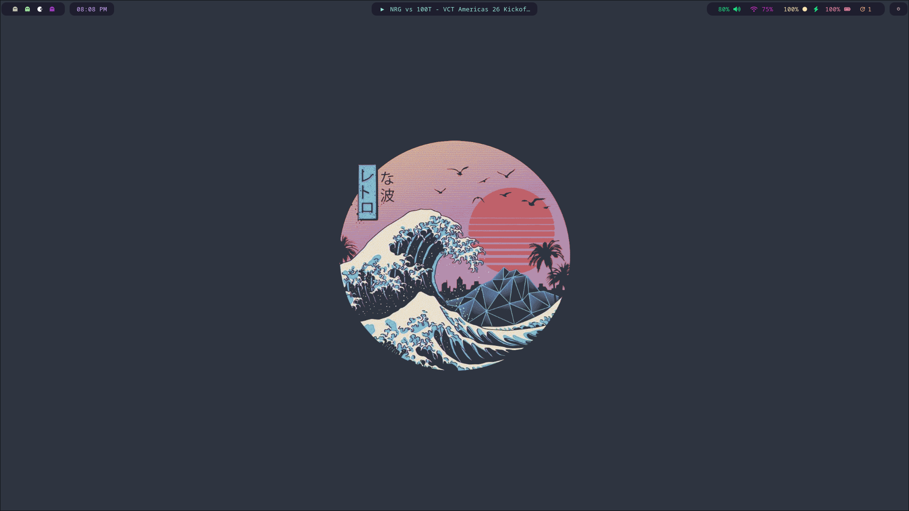
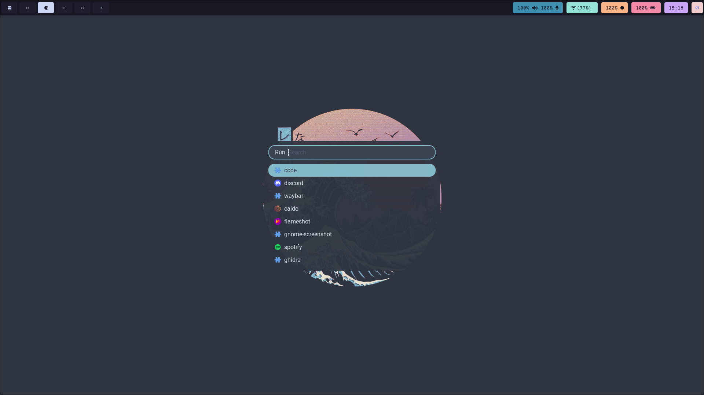
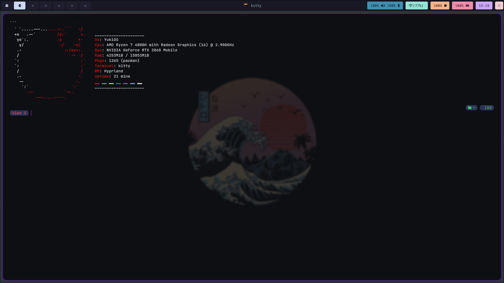
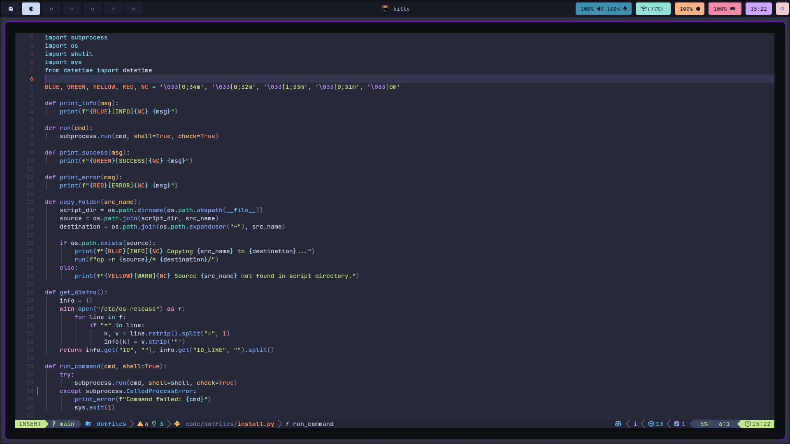

# 🎨 Hyprland Dotfiles

> A modern, automated Hyprland configuration with a sleek dark theme and optimized workflows



## ✨ Features

- **🪟 Hyprland**: Dynamic tiling Wayland compositor
- **🎯 Waybar**: Highly customizable status bar with workspace indicators
- **🚀 Rofi**: Fast application launcher with custom theme
- **💻 Kitty**: GPU-accelerated terminal emulator
- **📝 Neovim**: Extensible text editor configuration
- **🎨 Oh My Posh**: Beautiful shell prompt theming
- **🔔 Dunst**: Lightweight notification daemon
- **🎬 Auto-installer**: One-command setup script for multiple distributions

## 📸 Screenshots

### Desktop Overview


### Application Launcher (Rofi)


### Terminal (Kitty)


### Waybar 


### Neovim


## 🖥️ Supported Distributions

- **Arch Linux** (and derivatives: Manjaro, EndeavourOS)
- **Ubuntu** / **Debian** (and derivatives: Pop! OS)
- **Fedora**

## 📦 What Gets Installed

### Core Components
- **Hyprland** - Wayland compositor
- **SDDM** - Display manager
- **Waybar** - Status bar
- **Kitty** - Terminal emulator
- **Rofi** - Application launcher

### System Utilities
- **PulseAudio / PipeWire** - Audio management
- **Dunst** - Notifications
- **Polkit** - Authentication agent
- **NetworkManager** - Network management
- **Bluez / Blueman** - Bluetooth support

### Tools & Apps
- **Grim / Slurp** - Screenshot utilities
- **Swaylock / Swayidle** - Screen locking
- **Brightnessctl** - Brightness control
- **Thunar** - File manager
- **Firefox** - Web browser
- **Neovim** - Text editor
- **Neofetch / htop / btop** - System monitoring
- **Docker** - Containerization

### Fonts
- Noto Fonts (with emoji support)
- Font Awesome
- JetBrains Mono Nerd Font

## 🚀 Installation

### Quick Install

```bash
git clone https://github.com/yourusername/dotfiles.git
cd dotfiles
chmod +x install.sh
./install.sh
```

The installer will:
1. ✅ Detect your distribution automatically
2. ✅ Install all required packages
3. ✅ Deploy configuration files to `~/.config` and `~/.local`
4. ✅ Enable system services (SDDM, Bluetooth, NetworkManager, Docker)

### Manual Installation

If you prefer to run the Python installer directly:

```bash
python3 install.py
```

## 📁 Structure

```
dotfiles/
├── .config/
│   ├── hypr/          # Hyprland configuration
│   ├── waybar/        # Waybar configuration
│   ├── kitty/         # Kitty terminal config
│   ├── rofi/          # Rofi launcher theme
│   ├── nvim/          # Neovim configuration
│   ├── neofetch/      # Neofetch config
│   └── oh-my-posh/    # Shell prompt theme
├── .local/
│   ├── nvim/          # Neovim local files
│   └── rofi/          # Rofi local files
├── screenshots/       # Screenshots for README
├── install.py         # Main installation script
├── install.sh         # Bootstrap script
└── README.md          # This file
```

## ⚙️ Configuration

### Hyprland
Edit `~/.config/hypr/hyprland.conf` for window rules, keybindings, and compositor settings.

### Waybar
Customize `~/.config/waybar/config` for module configuration and `~/.config/waybar/style.css` for styling.

### Kitty
Modify `~/.config/kitty/kitty.conf` for terminal colors, fonts, and behavior.

### Rofi
Theme files are in `~/.config/rofi/` - customize colors and layout as needed.

## 🎨 Customization

All configuration files are modular and well-commented. Feel free to:
- Adjust color schemes
- Modify keybindings
- Add/remove packages
- Tweak window behavior
- Customize the status bar

## ⌨️ Key Bindings

| Keybinding | Action |
|------------|--------|
| `ALT + Return` | Open terminal |
| `ALT + D` | Launch Rofi |
| `ALT + Q` | Close window |
| `ALT + F` | Toggle fullscreen |
| `ALT + [1-9]` | Switch workspace |
| `ALT + Shift + [1-9]` | Move window to workspace |
| `ALT + Mouse` | Move/resize windows |
| `SUPER + SHIFT + S` | Screenshot |

*Note: Check `.config/hypr/hyprland.conf` for complete keybinding list*

## 🔧 Post-Installation

After installation and reboot:

1. **Login** to Hyprland via SDDM
2. **Check audio**: `pavucontrol` for audio settings
3. **Connect WiFi**: NetworkManager applet in system tray
4. **Bluetooth**: Use `blueman-manager` for device pairing
5. **Customize**: Edit configs in `~/.config/`

## 🐛 Troubleshooting

### Hyprland won't start
- Check logs: `cat /tmp/hypr/$(ls -t /tmp/hypr/ | head -n 1)/hyprland.log`
- Ensure your GPU drivers are installed

### Missing packages
- Manually install missing dependencies with your package manager
- Check install.py for the package list for your distro

### SDDM not starting
```bash
sudo systemctl status sddm
sudo systemctl enable sddm
sudo systemctl start sddm
```

## 🤝 Contributing

Feel free to fork, modify, and submit pull requests. Suggestions and improvements are always welcome!

## 🙏 Credits

- [Hyprland](https://hyprland.org/) - Wayland compositor
- Community dotfiles and configurations that inspired this setup
    - Waybar base config used - https://github.com/brunoanesio/waybar-config/
    - Kitty base config used - https://github.com/end-4/dots-hyprland
    - Neofetch base config used - https://github.com/linuxmobile/hyprland-dots/
    - Rofi theme from https://github.com/newmanls/rofi-themes-collection


---

**⭐ If you find these dotfiles useful, consider giving this repo a star!**