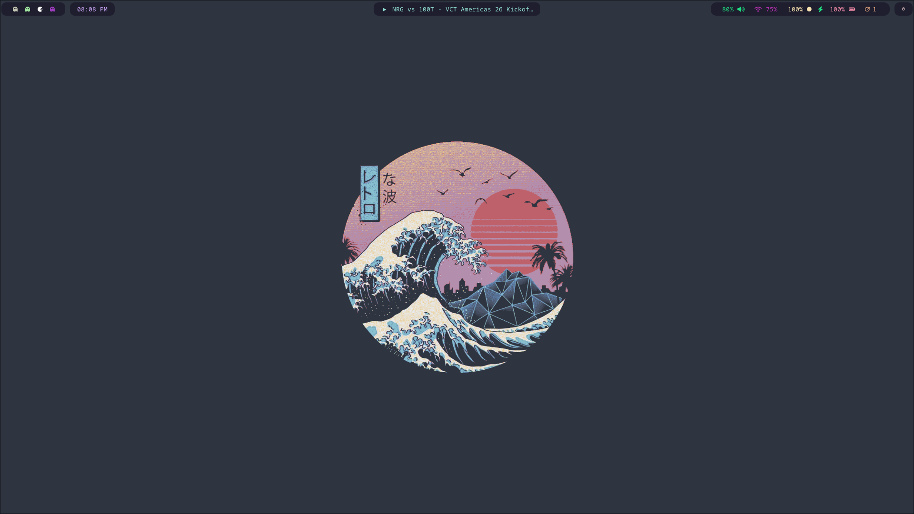

# ❄️ YukiOS Configuration Hub & Dotfiles

> A unified, interactive setup manager for modern, keyboard-driven Linux environments. Choose between high-fidelity layouts or ultra-performance builds for Hyprland, i3 Window Manager, and XFCE4.



---

## ⚙️ Features

- **🌐 Multiple Environments**: Support for Hyprland (Wayland), i3wm (X11), and XFCE4 (X11 Desktop Environment).
- **🎭 Performance Modes**:
  - **Fancy Builds**: Visual aesthetics with smooth animations, active-window shadows, and Kawase blur.
  - **Minimalist Builds**: Zero compositor lag, disabled animations, tight/no gaps, optimized for low memory & battery savings.
- **🖥️ Automated Menu**: A single interactive terminal menu with live ASCII previews of setups.
- **🎨 Catppuccin Mocha Aesthetic**: Unified color palette across all setups (Kitty, Rofi, Status Bar, Neovim).

---

## 🚀 Quick Installation

To launch the interactive profile selector, run the following commands in your terminal:

```bash
git clone https://github.com/niggetchuckens/dotfiles.git
cd dotfiles
python3 install_menu.py
```

The menu will automatically display live details and specs for each build. Select a profile and hit `Enter` to run its automated installation script.

---

## 📁 Repository Structure

```
dotfiles/
├── hyprland-dots/        # Hyprland Wayland configuration profiles
│   ├── default-config/   # Fancy profile (Waybar, Dunst, Rofi, Neovim)
│   ├── minimalist-config/# Battery-saver and high-fps profile
│   └── README.md         # Hyprland setup guide
│
├── i3-dots/              # i3 Window Manager X11 profiles
│   ├── fancy-config/     # Picom animations, shadows, rounded corners, gaps
│   ├── minimalist-config/# Compositor-free, lightweight tiling
│   └── README.md         # i3 setup guide
│
├── xfce/                 # XFCE4 Desktop Environment X11 profiles
│   ├── fancy-config/     # Transparent bottom panel, title window dimming
│   ├── minimalist-config/# Solid UI panel, compositor disabled
│   └── README.md         # XFCE4 setup guide
│
├── install_menu.py       # Main interactive Python launcher
└── README.md             # This file
```

---

## 🖼️ Desktop Environments & WMs

### 1. [Hyprland Dotfiles](file:///home/hime/dotfiles/hyprland-dots/README.md)
* **Fancy**: Dual-kawase blur, rounded corners, drop shadows, window animations.
* **Minimalist**: Minimal CPU overhead, animations off, optimized for high refresh rates.
* Read the [Hyprland Guide](file:///home/hime/dotfiles/hyprland-dots/README.md) for screenshots, keybindings, and troubleshooting.

### 2. [i3 Window Manager Dotfiles](file:///home/hime/dotfiles/i3-dots/README.md)
* **Fancy**: i3 status bar with custom picom config (fade-in, transparent terminal).
* **Minimalist**: Clean, fast X11 tiling layout with maximum efficiency.
* Read the [i3 WM Guide](file:///home/hime/dotfiles/i3-dots/README.md) for details.

### 3. [XFCE4 Desktop Dotfiles](file:///home/hime/dotfiles/xfce/README.md)
* **Fancy**: A customized modern panel layout with Catppuccin accents and terminal transparency.
* **Minimalist**: Clean traditional desktop layout, optimized for low memory usage and maximum performance.
* Read the [XFCE4 Guide](file:///home/hime/dotfiles/xfce/README.md) for details.

---

## 🔧 Prerequisites

Most profiles are tested on **Arch Linux** but also feature distribution fallback packages (like Debian/Ubuntu, Fedora, Kali, Pop!_OS) inside their installer scripts. 

Make sure you have `python3` installed to run the setup menu:
* Arch: `sudo pacman -S python`
* Debian/Ubuntu: `sudo apt install python3`
* Fedora: `sudo dnf install python3`

---

**⭐ If you find these dotfiles useful, consider giving this repo a star!**
