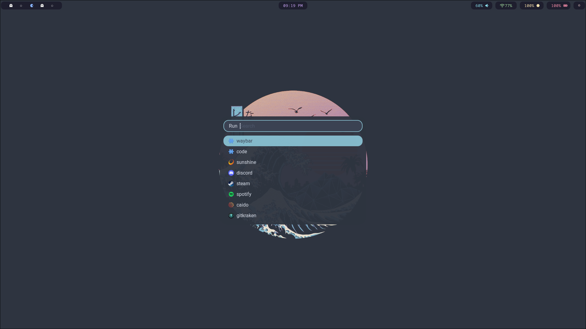
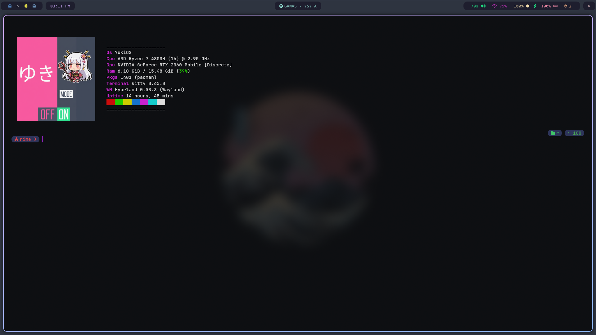
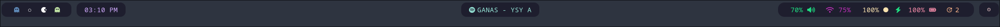
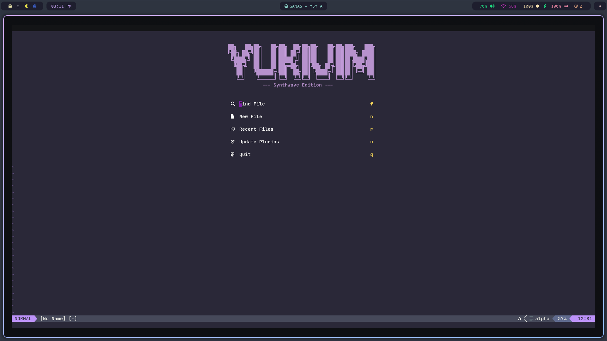

# 🎨 Hyprland Dotfiles (Fancy & Minimalist)

This folder contains the Hyprland configuration profiles matching the Catppuccin Mocha aesthetic.


## ✨ Features

- **🪟 Hyprland**: Dynamic tiling Wayland compositor
- **🎯 Waybar**: Highly customizable status bar with workspace indicators
- **🚀 Rofi**: Fast application launcher with custom theme
- **💻 Kitty**: GPU-accelerated terminal emulator
- **📝 Neovim**: Extensible text editor configuration
- **🎨 Oh My Posh**: Beautiful shell prompt theming
- **🔔 Dunst**: Lightweight notification daemon

## 📸 Screenshots

### Desktop Overview


### Application Launcher (Rofi)


### Terminal (Kitty)


### Waybar 


### Neovim


---

## 📁 Structure

```
hyprland-dots/
├── default-config/           # Fancy Build (Kawase blur, rounded corners, drop shadows, custom animations)
│   ├── .config/
│   │   ├── hypr/             # Hyprland configuration
│   │   ├── waybar/           # Waybar configuration
│   │   ├── kitty/            # Kitty terminal config
│   │   ├── rofi/             # Rofi launcher theme
│   │   ├── nvim/             # Neovim configuration
│   │   ├── neofetch/         # Neofetch config
│   │   └── oh-my-posh/       # Shell prompt theme
│   ├── .local/
│   │   ├── nvim/             # Neovim local files
│   │   └── rofi/             # Rofi local files
│   ├── screenshots/          # Screenshots for the profile
│   ├── FONTS.md              # Font requirements and installation
│   ├── install_fonts.py      # Script to automate font installation
│   └── install.py            # Installer script for fancy profile
│
└── minimalist-config/        # Minimalist Build (Animations off, zero blur, maximum performance)
    ├── .config/
    │   ├── hypr/             # Optimized Hyprland configuration
    │   └── ...
    ├── install.py            # Installer script for minimalist profile
    └── ...
```

---

## 🚀 Installation & Setup

Choose your preferred configuration profile and run the corresponding installation script.

### Option A: Fancy Setup (Recommended for standard/modern systems)
To install the visually rich profile with smooth animations and blur:
```bash
cd hyprland-dots/default-config
python3 install.py
```

### Option B: Minimalist Setup (Optimized for maximum battery/performance)
To install the lightweight profile with zero compositing overhead:
```bash
cd hyprland-dots/minimalist-config
python3 install.py
```

---

## ⌨️ Common Keybindings

| Keybinding | Action |
|------------|--------|
| `ALT + Return` | Open Kitty Terminal |
| `ALT + W` | Run Application Launcher (Rofi) |
| `ALT + Q` | Close current window |
| `ALT + F` | Toggle fullscreen |
| `ALT + [1-9]` | Switch workspace |
| `ALT + Shift + [1-9]` | Move window to workspace |
| `ALT + Mouse` | Move/resize windows |
| `SUPER + Shift + S` | Capture selection screenshot |

*Note: For a full list of keybindings, check the configuration in `.config/hypr/hyprland.conf`.*

## 🐛 Troubleshooting

### Hyprland won't start
- Check logs: `cat /tmp/hypr/$(ls -t /tmp/hypr/ | head -n 1)/hyprland.log`
- Ensure your GPU drivers are installed correctly.

### Missing packages
- Manually install missing dependencies with your package manager.
- Check `install.py` for the package list for your distribution.
